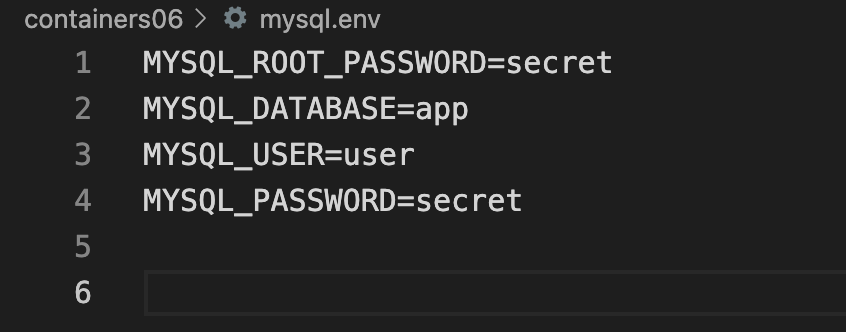

# Лабораторная работа №6: Создание многоконтейнерного приложения

## Цель работы

Ознакомиться с работой многоконтейнерного приложения на базе docker-compose.

## Задание

Создать php приложение на базе трех контейнеров: nginx, php-fpm, mariadb, используя docker-compose.

## Выполнение

Создайте файл .gitignore в корне проекта и добавьте в него строки:

Создайте в директории containers06 файл nginx/default.conf со следующим содержимым:

Создайте файл mysql.env в корне проекта и добавьте в него строки:

Запустите контейнеры командой:

## Выводы

В данной лабораторной работе я ознакомился с основами многоконтейнерных приложений, используя Docker. Мы создали простое многоконтейнерное приложение, состоящее из веб-сервиса на PHP и сервиса базы данных MySQL.

## Ответьте на вопросы:

1.Порядок запуска контейнеров: Контейнеры запускаются в порядке, определенном в файле docker-compose.yml. Сначала запускается контейнер database, затем backend, и наконец frontend.

2.Хранение данных базы данных: Данные базы данных хранятся в Docker томе с именем db_data, который был определен в разделе volumes файла docker-compose.yml.

3.Названия контейнеров проекта: Контейнеры вашего проекта названы соответственно: frontend, backend и database.

4.Внутри app.env указать переменную окружения APP_VERSION со значением APP_VERSION=1.0.0

В файл docker-compose.yml добавить раздел env_file для сервисов backend и frontend, указывая путь к вашему файлу app.env.

  env_file:  
    - ./app.env